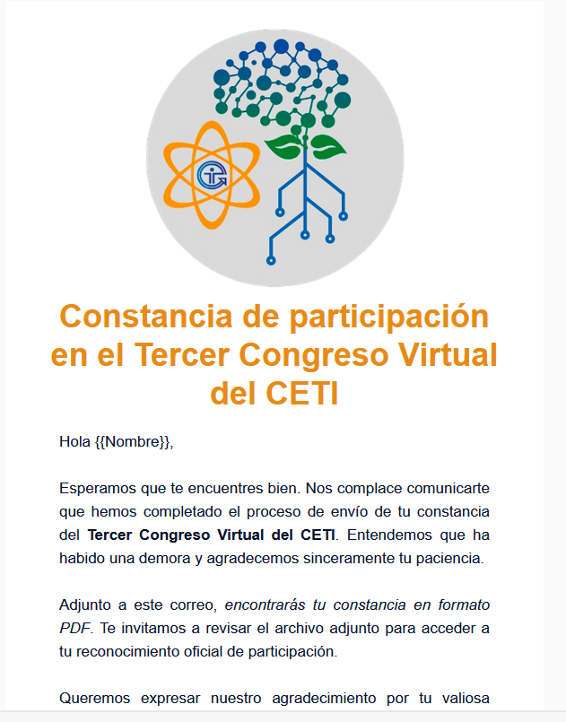

# CETI Congress Email Automation

## Overview

This project was developed to automate the email campaign for the **Centro de Enseñanza Técnica Industrial (CETI) Congress** held between **September 2023 - November 2023**. The goal was to create an in-house **Email Service Provider (ESP)** using **Google API** through **Google Apps Script**, solving the challenge of managing a **300-participant list** without a budget for commercial solutions.

## Technologies Used

- **JavaScript (Google Apps Script)**
- **HTML & CSS**
- **Google API**

    <h3>HTML Email template example:</h3>
    

  
